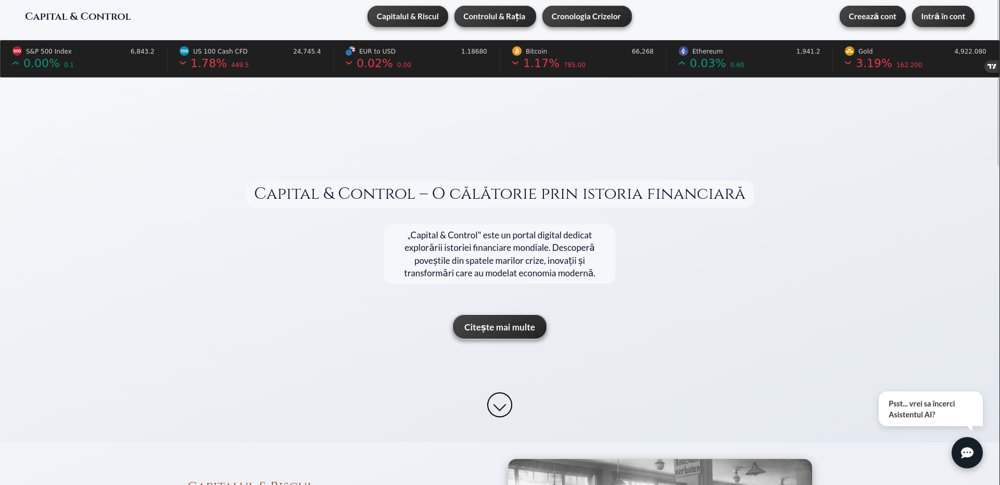

# Capital & Control

Capital & Control is a digital portal dedicated to exploring global financial history. The project examines the economic transformations that have shaped the modern world, analyzing the delicate balance between market risks and state control.

The platform provides educational insights into historical financial crises, the psychology of markets (greed vs. fear), and the socio-economic impacts of planned economies versus free markets.

## Project Preview



## Installation and Setup

To run this project locally or on a dedicated server, this application requires a standard LAMP stack (Linux, Apache, MySQL, PHP). Below are the specific steps to deploy using the Apache2 web server.

### 1. Install Apache and PHP
Update your package index and install the necessary software.

```bash
sudo apt update
sudo apt install apache2 php libapache2-mod-php
```